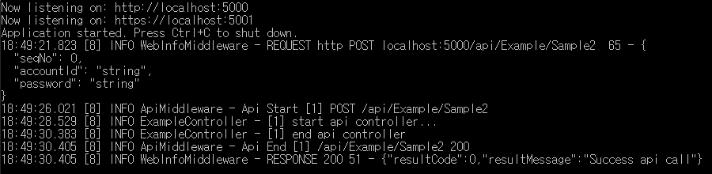

# ASP.Net Core Templates

asp.net core와 관련된 프로젝트들을 바로 개발에 적용할 수 있게 템플릿 형대로 제공

## Documents

### ApiServer

#### 목적

템플릿으로 제공되는 컨트롤러를 활용해 비즈니스 로직만 쉽게 개발하는 것을 목표로 한다.

#### 내장된 서비스
- Redis
- Memcached
- Dapper ( for RDBS )
- NLog
- Swagger

Redis나 Memcached, DB 등을 사용을 위해서는 appsetting.json에 관련된 정보를 넣음으로써 바로 사용할 수 있고 ASP.Net Core 형태에 맞게 각 서비스는 DI으로 제공이 된다.

#### 특징
- Swagger를 기존보다 좀더 확장된 문서형태로 제공이 되며 주석으로 좀더 api설명에 디테일함을 넣을 수 있다.
- Log 방식이 Middleware를 활용해 각 api 컨트롤러의 연속성을 표현할 수 있다.
- 컨트롤러의 Exception를 감지해 사용자 입장에서 예외처리를 다루기 쉽게 되어있다.

#### 예시

Swagger 문서 활용 샘플

Logging 처리 샘플

### SignalRServer (Real Time)

실시간 채팅을 위한 SignalR 활용 